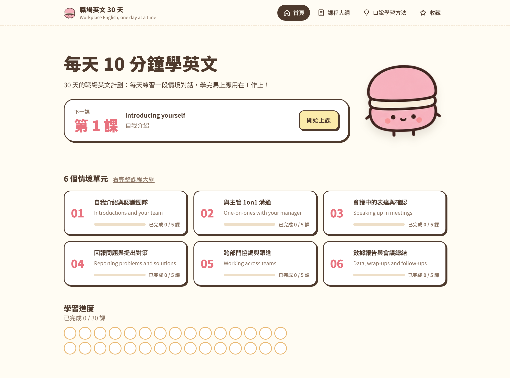

# 職場英文 30 天 🍬

**30 天的職場英文計劃：每天練習一段情境對話，學完馬上應用在工作上！**

👉 **立即使用：<https://kekeuwu.github.io/workplace-english/>**

免費、不用註冊、打開就能用，手機和電腦都適用。



---

## 網站有什麼

- 職場常用英文情境：自我介紹、跟主管 1on1、開會插話、回報延誤、跨部門協調⋯⋯
- 每句對話都有語音，主管、同事、你自己的聲音都不一樣
- 附常用單字與片語
- 喜歡的句子可以收藏，用翻卡複習

---

## 課程內容

6 個單元，每單元 5 課，共 30 課。

| 單元 | 主題 | 課程 |
| --- | --- | --- |
| 01 | 自我介紹與認識團隊 | 自我介紹、認識團隊與角色、第一次開會、回應日常寒暄、茶水間閒聊 |
| 02 | 與主管 1on1 溝通 | 更新工作進度、請求協助、討論目標、接受回饋、提出想法與職涯規劃 |
| 03 | 會議中的表達與確認 | 會議中插話與發言、報告進度、被問倒時怎麼回、表達同意與補充、委婉表達不同意 |
| 04 | 回報問題與提出對策 | 回報延誤、解釋原因、提出解決方案、評估風險、協商期限 |
| 05 | 跨部門協調與跟進 | 請求資源支援、跟進進度、對齊期望、處理意見衝突、分派任務 |
| 06 | 數據報告與會議總結 | 用數據說話、會議總結與待辦事項、會後 email 跟進、視訊會議狀況處理、30 天綜合模擬 |

課程不一定要連續 30 天上完，中間停幾天也沒關係，挑需要的情境先學也可以。

---

## 建議的練習方式：每天 10 分鐘

1. **聽懂（約 2 分鐘）**：先看中英對照，把整段對話弄懂。
2. **跟讀 Shadowing（約 5 分鐘）**：一句一句播放，聽完馬上跟著唸；熟了之後遮住文字，慢半拍跟著原音唸。
3. **練習產出（約 3 分鐘）**：把句型換成自己的工作內容，或用 AI 語音模式找它對練。

網站裡的「口說學習方法」頁有更完整的說明和可以直接複製的 AI 提示詞。

---

## 隱私說明

- **學習資料只存在你的瀏覽器**：收藏和學習進度都存在你自己的瀏覽器裡，不會上傳到任何伺服器；換裝置或清除瀏覽器資料就不會保留。
- **流量分析**：網站使用 Google Analytics 了解整體使用情況（例如哪幾課最多人看），不會蒐集你的姓名或聯絡方式。

---

## 技術說明

給想了解或修改這個專案的人：

- **純靜態網站**：只有 HTML、CSS、JavaScript，沒有後端和資料庫，部署在 GitHub Pages。
- **課程內容**：全部寫在 `index.html` 裡。
- **對話語音**：AI 語音合成，用 [edge-tts](https://github.com/rany2/edge-tts) 預先產生成 MP3，放在 `audio/`。
- **本機執行**：在專案資料夾執行下面的指令，再打開 <http://localhost:8765>。

  ```bash
  python -m http.server 8765
  ```
- **改了對話內容之後，重新產生語音**：只會產生新增或修改過的句子。

  ```bash
  pip install edge-tts
  python tools/make_audio.py
  ```

---

## 意見回饋

有想學的職場情境、發現錯字或內容有誤，歡迎到 [Issues](https://github.com/kekeuwu/workplace-english/issues) 留言告訴我 🐰
